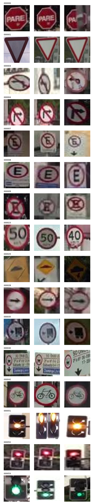
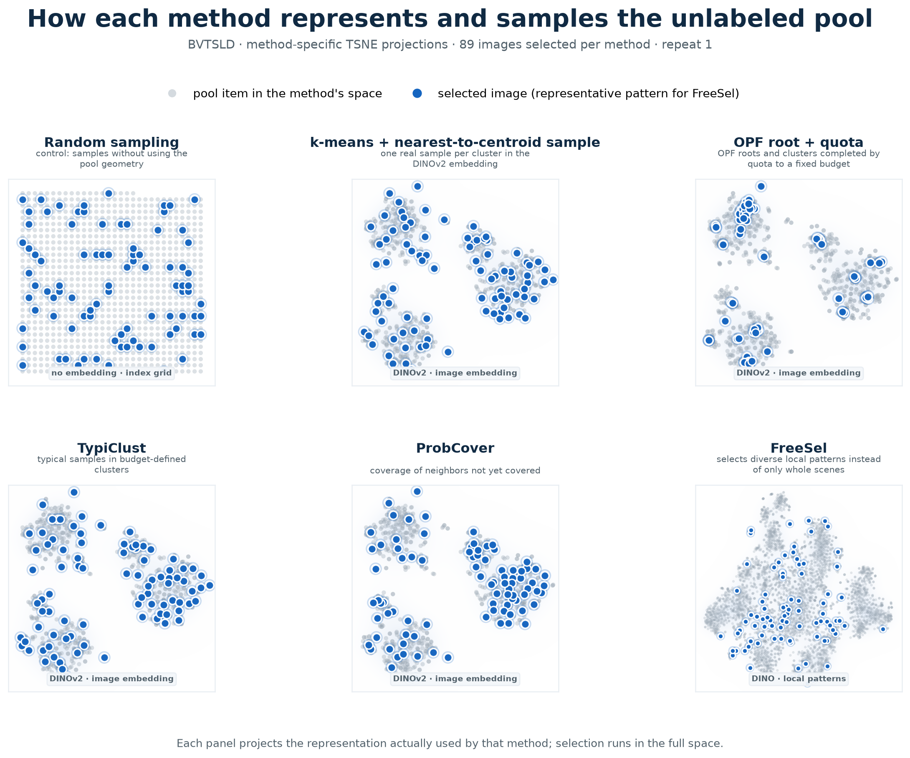
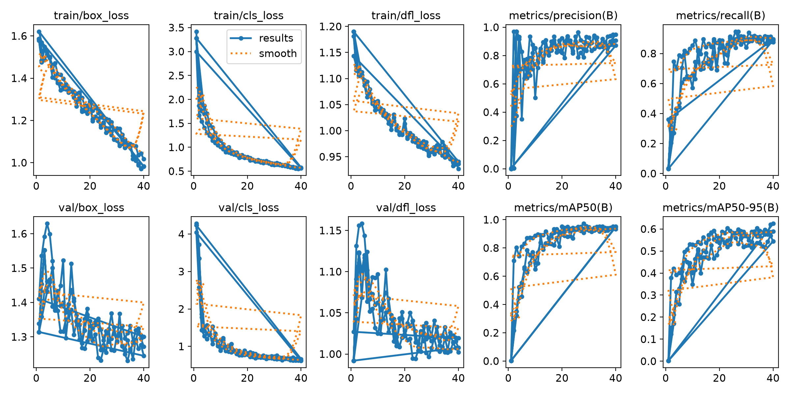
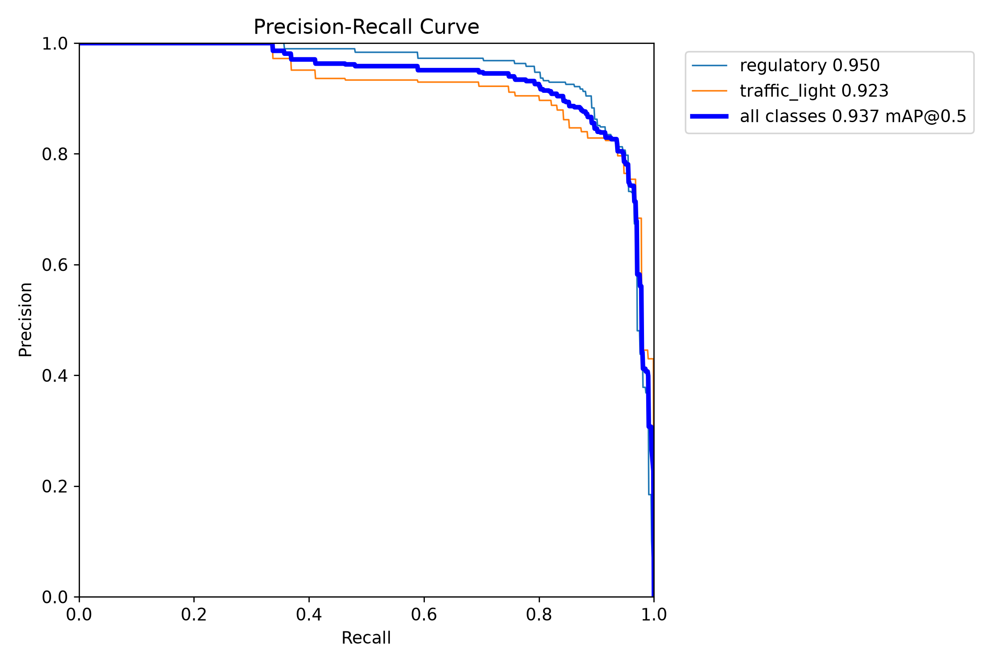
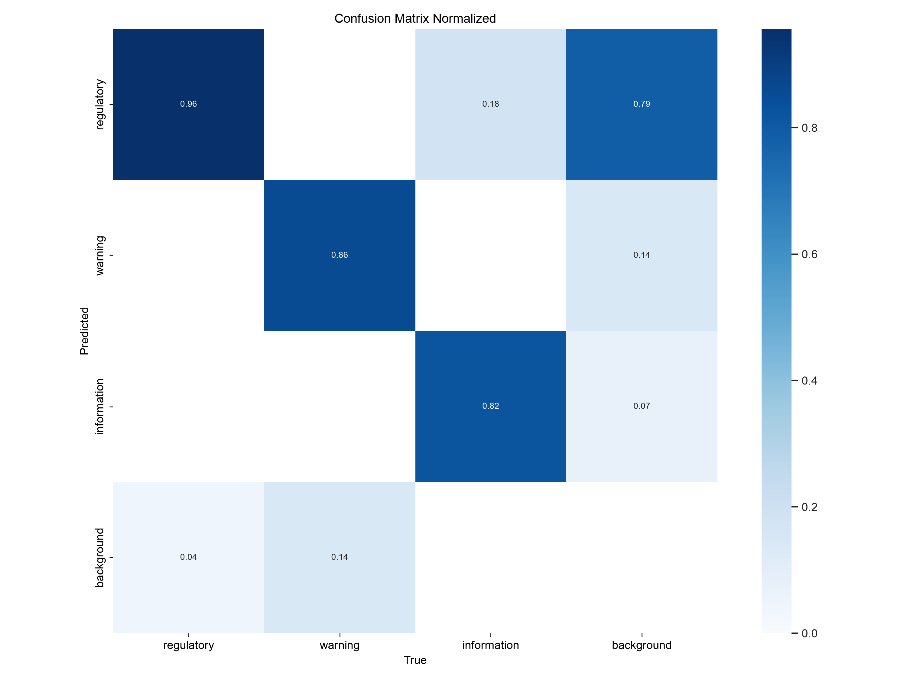
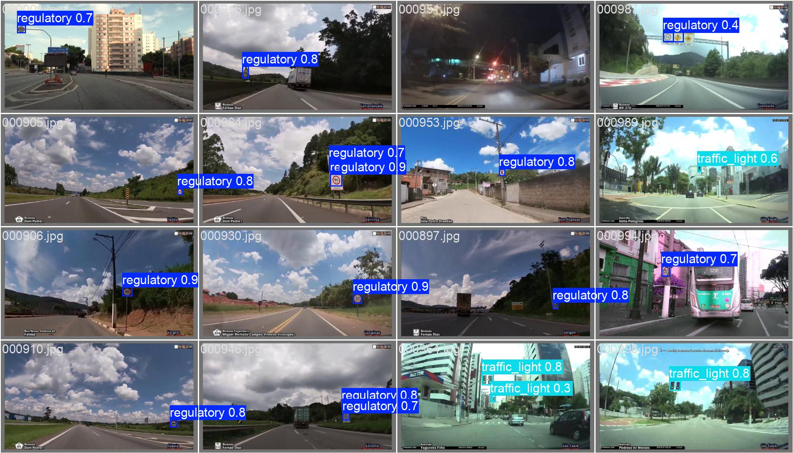

# Pergunta de pesquisa

É possível escolher, **sem usar rótulos do dataset-alvo**, um pequeno conjunto
de imagens que preserve o desempenho de um detector de sinais de trânsito?

## BVTSLD sample selection benchmark

Este projeto investiga **cold-start sample selection** para traffic sign
detection. O objetivo é medir quanto do desempenho do YOLOv8n oracle pode ser
preservado treinando com 5% ou 10% do BVTSLD pool.

## Estado reproduzível

- Dataset: 990 clean images, 1.279 bounding boxes e 373 quarantined images.
- Fixed split (seed 42): 693 train pool, 148 validation e 149 test images.
- Target classes: `regulatory`, `warning` e `information`.
- 160 selections: 10 methods × 2 fractions × 8 repeats.
- Oracle: YOLOv8n, 640 px, 40 epochs, SGD, seed 42.
- Oracle validation: mAP@0.5 `0.9483`; mAP@0.5:0.95 `0.6270`.
- O test split permanece fechado até a escolha final do method e da fraction.

O checkpoint local do oracle fica em
`outputs/bvtsld/runs/oracle/weights/best.pt`, mas não é versionado no Git. O
protocolo e as metrics estão em
[`oracle_results.json`](outputs/bvtsld/oracle_results.json); o inventário
compacto está em [`project_status.json`](outputs/bvtsld/project_status.json).

## Resultados obtidos até o momento

### Dataset audit e fixed split

| Resultado | Valor |
|---|---:|
| Imagens originais elegíveis | 990 |
| Bounding boxes | 1.279 |
| `regulatory` bounding boxes | 1.084 |
| `warning` bounding boxes | 98 |
| `information` bounding boxes | 97 |
| Quarantined images com traffic lights fora da target taxonomy | 373 |
| Train pool | 693 imagens |
| Validation split | 148 imagens |
| Test split | 149 imagens |
| Split leakage | 0 imagens |

Fontes: [`records.json`](outputs/bvtsld/records.json),
[`split.json`](outputs/bvtsld/split.json),
[`quarantine.json`](outputs/bvtsld/quarantine.json) e
[`taxonomy_report.json`](outputs/bvtsld/taxonomy_report.json).



*Exemplos auditados das source categories do BVTSLD. As três últimas linhas
(`000051`, `000052` e `000053`) são traffic lights e ficam em quarantine; as
demais são mapeadas para as três target classes.*

### Sample-selection diagnostics

Foram geradas e auditadas 160 selections: 10 methods × 2 label fractions × 8
repeats. As tabelas abaixo são diagnostics calculados **antes do YOLO
training**. Portanto, elas medem representação do pool, stability, quantidade
de bounding boxes recuperadas e selection runtime; ainda não determinam o
method vencedor.

`Δ coverage` compara cada method com `random` na mesma fraction. Valores
negativos são melhores. `Δ worst-case` usa a maior cosine distance encontrada;
valores negativos também são melhores. `Jaccard` mede a stability entre
selection instances.



*Uma selection instance real de cada method, com label fraction de 10%. Os
pontos cinza são os pool items no representation space efetivamente usado pelo
method; os pontos azuis representam as 69 selected images. Em `FreeSel`, cada
imagem possui cinco local patterns, mas apenas um representative/selection-driving
pattern é destacado por selected image para manter a comparação visual em 69
pontos azuis. `Random sampling` não usa embedding e aparece em um arbitrary
index grid. Cada t-SNE é independente e serve apenas para visualização; a
selection opera no respectivo full-dimensional space.*

#### Label fraction 5% — 35 imagens por selection

| Method | Coverage | Δ coverage | Δ worst-case | Jaccard | Bounding boxes | Runtime (s) |
|---|---:|---:|---:|---:|---:|---:|
| `kmeans_dinov2` | 0,1996 | −18,1% | −18,2% | 0,305 | 48,4 | 3,9 |
| `typiclust_dinov2` | 0,2006 | −17,7% | −17,3% | 0,307 | 49,5 | 6,3 |
| `probcover_dinov2` | 0,2051 | −15,8% | −18,0% | 0,490 | 48,8 | 3,1 |
| `facility_dinov2` | 0,2060 | −15,4% | −17,1% | 0,151 | 48,0 | 0,2 |
| `kmeans_clip` | 0,2220 | −8,9% | −19,7% | 0,215 | 46,0 | 5,0 |
| `kmeans_shallow` | 0,2256 | −7,4% | −16,1% | 0,250 | 46,5 | 18,3 |
| `random` | 0,2436 | 0,0% | 0,0% | 0,028 | 44,0 | <0,1 |
| `opf_dinov2` | 0,2486 | +2,0% | +14,4% | 1,000¹ | 50,0 | 24,6 |
| `freesel_dino` | 0,2575 | +5,7% | −16,1% | 0,330 | 44,2 | 0,5 |
| `kcenter_dinov2` | 0,2860 | +17,4% | −41,8% | 0,391 | 43,1 | 0,2 |

#### Label fraction 10% — 69 imagens por selection

| Method | Coverage | Δ coverage | Δ worst-case | Jaccard | Bounding boxes | Runtime (s) |
|---|---:|---:|---:|---:|---:|---:|
| `kmeans_dinov2` | 0,1655 | −19,6% | −25,5% | 0,293 | 92,4 | 7,0 |
| `typiclust_dinov2` | 0,1666 | −19,1% | −23,9% | 0,274 | 93,2 | 12,4 |
| `probcover_dinov2` | 0,1708 | −17,0% | −20,5% | 0,414 | 93,2 | 4,4 |
| `facility_dinov2` | 0,1742 | −15,3% | −22,5% | 0,139 | 92,8 | 0,2 |
| `kmeans_clip` | 0,1833 | −10,9% | −21,3% | 0,224 | 90,1 | 8,2 |
| `kmeans_shallow` | 0,1869 | −9,2% | −17,8% | 0,267 | 88,1 | 30,6 |
| `freesel_dino` | 0,2048 | −0,5% | −19,5% | 0,494 | 83,2 | 0,9 |
| `random` | 0,2058 | 0,0% | 0,0% | 0,056 | 88,4 | <0,1 |
| `opf_dinov2` | 0,2211 | +7,4% | +15,1% | 1,000¹ | 99,0 | 23,8 |
| `kcenter_dinov2` | 0,2257 | +9,7% | −53,2% | 0,426 | 86,9 | 0,3 |

¹ OPF é determinístico neste pool: os oito repeats produzem a mesma selection.

Até aqui, `kmeans_dinov2`, `typiclust_dinov2`, `probcover_dinov2` e
`facility_dinov2` apresentam a melhor mean coverage nas duas fractions.
`kcenter_dinov2` apresenta a melhor worst-case coverage, enquanto
`opf_dinov2` recupera mais bounding boxes. Essas observações são apenas
hypotheses: o ranking final depende do validation mAP@0.5:0.95.

Fonte completa: [`selections_summary.csv`](outputs/bvtsld/selections_summary.csv).
As selection instances individuais estão em
[`outputs/bvtsld/selections/`](outputs/bvtsld/selections/) e as visualizações
empíricas em [`figs/`](figs/).

### YOLOv8n oracle

O oracle foi treinado com 100% do train pool no fixed protocol. Somente o
validation split foi avaliado.

| Split | mAP@0.5 | mAP@0.5:0.95 | AP@0.5 `regulatory` | AP@0.5 `warning` | AP@0.5 `information` |
|---|---:|---:|---:|---:|---:|
| Validation | 0,9483 | 0,6270 | 0,9645 | 0,9721 | 0,9082 |



*Training e validation losses, precision, recall e mAP ao longo das 40 epochs.*



*Precision–recall curves no validation split. O valor agregado é 0,948
mAP@0.5.*



*Normalized confusion matrix do oracle no validation split. A coluna
`background` evidencia false positives; a linha `background`, false
negatives.*



*Exemplos de predictions do oracle. As bounding boxes mostram a target class e
a confidence atribuída pelo detector.*

- Training time: 2.318,2 s, aproximadamente 38,6 min, em Apple M2 Pro/MPS.
- Checkpoint local: `outputs/bvtsld/runs/oracle/weights/best.pt` (ignorado pelo Git).
- Protocol e metrics: [`oracle_results.json`](outputs/bvtsld/oracle_results.json).
- As curvas e validation figures relevantes estão versionadas em [`figs/`](figs/).

### Status dos selection training runs

| Etapa | Status |
|---|---:|
| Saved selections | 160/160 |
| Materialized YOLO training configs | 160/160 |
| Smoke training | aprovado |
| Full selection training grid | **0/320 runs** |

O smoke training de duas epochs verifica apenas que dataset, labels, selection,
YOLO training, validation e persistência dos artifacts funcionam de ponta a
ponta. Seu mAP não é resultado experimental. Os primeiros comparative mAP
results aparecerão em `outputs/bvtsld/triage_results.csv` durante a execução da
full grid. O estado auditável atual está em
[`project_status.json`](outputs/bvtsld/project_status.json).

## Termos

| Termo | O que é |
|---|---|
| **pool** | as imagens de treino disponíveis; fingimos que nenhuma tem rótulo |
| **fração de rótulos** | quanto do pool ganha rótulo manual: 5, 10, 20 ou 50% |
| **seleção** | o subconjunto de imagens escolhido para receber rótulo manual |
| **embedding** | um vetor de números que resume o conteúdo de uma imagem, gerado por uma rede pronta (não precisa de rótulo para calcular) |
| **agrupamento (clustering)** | juntar imagens de embedding parecido em grupos ("cenas de rodovia", "ruas à noite"...) |
| **amostragem estratificada** | montar a seleção pegando um pouco de cada grupo, proporcional ao tamanho do grupo — em vez de sortear no escuro |
| **cobertura** | distância média de cada imagem do pool à imagem selecionada mais parecida — mede, sem treinar nada, o quão bem a seleção representa o pool |
| **oráculo** | YOLO treinado com 100% dos rótulos — o teto de referência |
| **instância de seleção** | uma execução independente da técnica, identificada por uma semente de seleção; é a unidade de comparação com o sorteio |
| **semente de treino** | inicialização e aleatoriedade do YOLO; cada instância de seleção é treinada com as mesmas 2 sementes em todas as técnicas |

## Methods

`Full-dimensional space` é o espaço usado pelo algoritmo antes da t-SNE. Cada
painel comprime seu próprio espaço para duas dimensions; posições de painéis
diferentes não compartilham o mesmo sistema de coordenadas. Os methods com
representation usam L2-normalized vectors e cosine distance. Ground-truth
labels nunca decidem a selection.

| Method | Representation space | O que cada ponto representa | Como seleciona | Intuição experimental |
|---|---|---|---|---|
| `random` | Nenhum embedding | Uma imagem em um arbitrary index grid | Sorteia uniformemente 69 imagens. | Control baseline: mede o que cada method acrescenta além do acaso. |
| `kmeans_dinov2` | DINOv2, 384 dimensions | Uma whole image | Forma `k = 69` clusters e escolhe o medoid de cada cluster. | Representar cada global scene cluster por uma imagem real. |
| `kmeans_clip` | CLIP, 512 dimensions | Uma whole image | Repete k-means + medoid no CLIP embedding. | Isolar o efeito da representation mantendo a selection rule fixa. |
| `kmeans_shallow` | Color, texture e edge features, 2.276 dimensions | Uma whole image | Repete k-means + medoid sem deep embedding. | Verificar quanto deep representations acrescentam sobre visual low-level features. |
| `opf_dinov2` | DINOv2, 384 dimensions | Uma whole image | Usa OPF roots como density peaks e completa o budget com proportional cluster quotas. | Descobrir clusters adaptativamente, sem impor `k = budget` ao agrupamento inicial. |
| `typiclust_dinov2` | DINOv2, 384 dimensions | Uma whole image | Forma 69 clusters e escolhe a imagem de maior local density em cada um. | Priorizar typical samples de dense regions e evitar outliers. |
| `kcenter_dinov2` | DINOv2, 384 dimensions | Uma whole image | Adiciona iterativamente a imagem mais distante do current selected set. | Maximizar worst-case coverage, mesmo que isso atraia outliers. |
| `probcover_dinov2` | DINOv2, 384 dimensions | Uma whole image | Escolhe a imagem que cobre mais ainda-uncovered neighbors dentro de um radius estimado sem labels. | Cobrir dense regions sem perseguir todo ponto extremo. |
| `facility_dinov2` | DINOv2, 384 dimensions | Uma whole image | Maximiza de forma greedy a similarity de cada pool image ao nearest selected representative. | Obter um subset globalmente representativo do pool. |
| `freesel_dino` | Local DINO patterns, 384 dimensions | Uma local region: cinco patterns por imagem, totalizando `693 × 5 = 3.465` pontos cinza | Procura o ainda-uncovered pattern mais distante; sua parent image entra na selection e seus cinco patterns passam a representar aquela imagem. | Encontrar imagens com uma local region nova, como uma placa pequena, mesmo quando a whole scene já parece representada. Na figura, um representative pattern azul é mostrado para cada uma das 69 selected images. |

## Trabalho futuro — dissertação

A selection vencedora define o labeled initial set; o restante do pool entra
sem labels por meio de pseudo-labels:

- **FixMatch**: a prediction na view com *weak augmentation* vira pseudo-label
  quando a confidence supera um fixed threshold (`τ = 0,95`) e supervisiona a
  view com *strong augmentation*.

- **FreeMatch**: substitui o fixed threshold por global and per-class adaptive
  thresholds, estimados por EMA da confidence do próprio model. Isso é
  relevante quando as classes têm frequências muito diferentes, como
  `information`.

- **SoftMatch**: substitui o binary cutoff por continuous confidence weighting,
  usando um Gaussian weight centrado na mean confidence, para equilibrar
  quantidade e qualidade dos pseudo-labels.

## Uso

### Preparar um clone novo

```bash
git clone <URL_DO_REPOSITORIO>
cd wvc2026-deteccao-placas
python3 -m venv .venv
.venv/bin/pip install -r requirements.txt
```

O BVTSLD não é versionado. Coloque o dataset em:

```text
datasets/bvtsld/Brazilian Vertical Traffic Signs and Lights Dataset/
```

Os compact experiment results e as 160 selections estão no Git. Raw images,
embeddings, materialized YOLO datasets, checkpoints e training runs permanecem
locais. Para compartilhar checkpoints, use um release ou artifact storage em
vez do histórico principal do repositório.

### Validar e treinar

O ambiente deve usar as versões de `requirements.txt`, incluindo
`ultralytics==8.3.0`:

```bash
.venv/bin/python scripts/validate_bvtsld.py
.venv/bin/python scripts/run_local_triage.py --dry-run
.venv/bin/python scripts/run_local_triage.py --smoke
.venv/bin/python scripts/run_local_triage.py
```

O training runner é resumable: cada completed run entra em
`outputs/bvtsld/triage_results.csv` e não é repetido. Para executar apenas uma
parte da grid:

```bash
.venv/bin/python scripts/run_local_triage.py \
  --technique typiclust_dinov2 --fraction 0.10 --repeat 1 --train-seed 42
```

Após completar os 320 runs:

```bash
.venv/bin/python scripts/analyze_triage.py outputs/bvtsld/triage_results.csv \
  --output outputs/bvtsld/triage_analysis.csv
```

## Fixed YOLO protocol

YOLOv8n pretrained on COCO; input 640 × 640; 40 epochs; `patience=0`; SGD;
batch 16; deterministic training; train seeds 41 and 42. Augmentations:
HSV `(0.015, 0.7, 0.4)`, translation `0.1`, scale `0.5`, horizontal flip
`0.5`, mosaic `1.0` closed for the final 10 epochs, and erasing `0.4`.

Selection ranking uses validation mAP@0.5:0.95. Each repeat is paired with
the same random baseline and train seed. Analysis reports paired mean gain,
hierarchical bootstrap 95% CI, exact sign randomization and Holm correction.
The minimum practically relevant gain is `0.02` mAP.

## Artifact layout

```text
README.md                                overview, protocol and current results [Git]
requirements.txt                         pinned Python dependencies [Git]
scripts/                                 audit, selection, training and analysis [Git]
figs/                                    curated publication figures [Git]
outputs/bvtsld/records.json              clean annotations [Git]
outputs/bvtsld/split.json                fixed pool/validation/test split [Git]
outputs/bvtsld/selections/*.json         160 sample selections [Git]
outputs/bvtsld/selections_summary.csv    coverage, stability and runtime [Git]
outputs/bvtsld/oracle_results.json       oracle protocol and validation metrics [Git]
outputs/bvtsld/triage_results.csv        selection training metrics [Git, when generated]
datasets/bvtsld/                         raw dataset [local]
outputs/bvtsld/embeddings_*.npy          frozen embeddings [local]
outputs/bvtsld/yolo_bvtsld/              materialized YOLO dataset [local]
outputs/bvtsld/runs/                     checkpoints and training runs [local]
```
